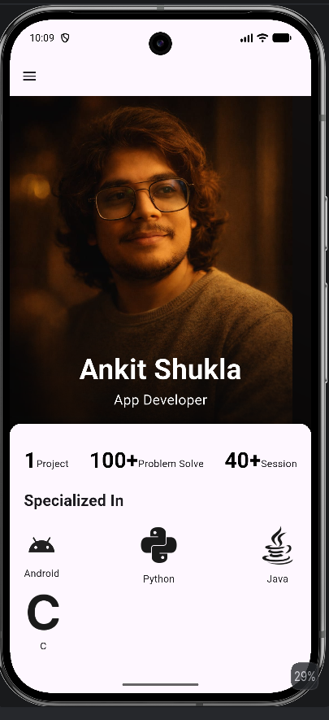
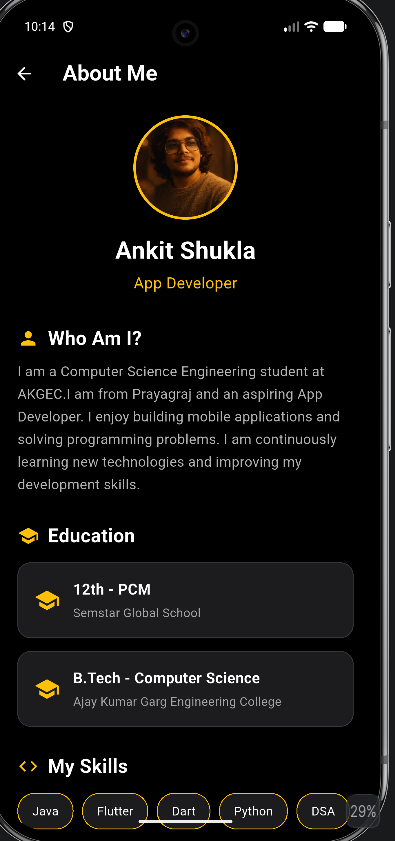

Portfolio App

App Description

This is a Flutter-based mobile application developed as a project to demonstrate the use of Flutter and Dart for building modern and responsive user interfaces.

The app provides a simple, clean, and user-friendly interface. It is designed to demonstrate navigation between different screens, UI components, layouts, and basic Flutter functionality.

Features
Clean and responsive user interface
Multiple screens/pages
Navigation between screens
Modern UI design
Built using Flutter and Dart
Runs on Android devices and emulators

Screenshot

### Home Screen

### Profile

How to Run the Project Locally

1. git clone https://github.com/Ankoder-tech/Portfolio-App.git
2. cd my_app
3. flutter pub get
4. Start an Android Emulator from Android Studio
    run the command flutter devices 
5. flutter run
The application will build and launch on your connected device or emulator.    
